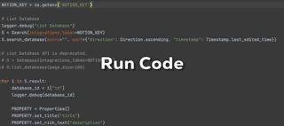

[](https://github.com/minwook-shin/notion-database/actions/workflows/python-publish.yml)

#  Python Notion Database
> Database of Pythonic Notion API



created by database from the official Notion API.

"notion database" is Notion API wrapper library.

```python
import os

from notion_database.page import Page
from notion_database.properties import Properties
from notion_database.query import Direction, Timestamp
from notion_database.search import Search

S = Search(integrations_token=os.getenv('NOTION_KEY'))
S.search_database(query="", sort={"direction": Direction.ascending, "timestamp": Timestamp.last_edited_time})
for i in S.result:
  PROPERTY = Properties()
  PROPERTY.set_title("title", "title")
  PROPERTY.set_rich_text("Description", "description text")
  P = Page(integrations_token=os.getenv('NOTION_KEY'))
  P.create_page(database_id=i["id"], properties=PROPERTY)
```
See detailed example [here](example.py).

## What's new notion-version

* 2022.08.01
  * **Update notion-version (2022-06-28)**

* 2022.03.27
  * **Update notion-version (2022-02-22)**
    * Using officially API (out of beta!).
    * https://developers.notion.com/changelog/releasing-notion-version-2022-02-22
    
* 2021.09.01
    * **Update notion-version (2021-08-16)**

## Installing / Getting started

```shell
pip install notion-database
```

### Docs

https://notion-database.readthedocs.io

## Building / Developing

```shell
python setup.py install
```

## Features

* Blocks
  * ✅ Append block children
  * ✅ Retrieve block children
* Pages
  * ✅ Create a page
  * ✅ Retrieve a page
  * ✅ Retrieve a page property item
  * ✅ Update page properties
  * ✅ Archive a page
* Databases
  * ✅ Create a database
  * ❎ Query a database
    * partial support
  * ✅ Retrieve a database
  * ✅ Update a database
  * ✅ Update database properties

## Contributing

If you'd like to contribute, please fork the repository and use a feature branch. Pull requests are warmly welcome.

## Links

- Notion API : https://developers.notion.com

## Licensing

The code in this project is licensed under GPL license.

## Example project using this package

* jira-2-notion-db
  * https://github.com/minwook-shin/jira-2-notion-db